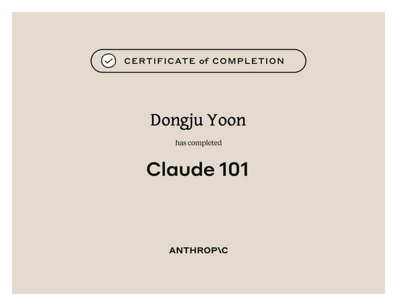
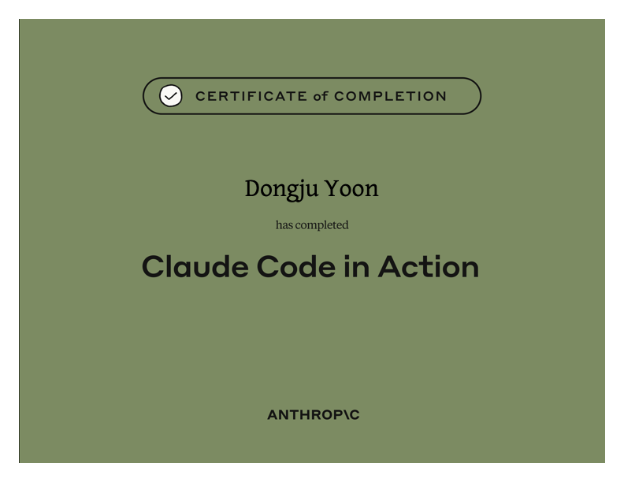
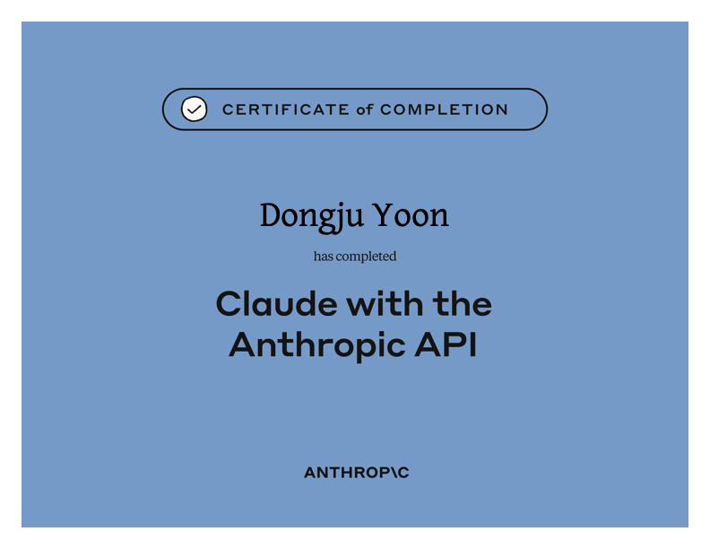

## 안녕하세요, 윤동주입니다. 
AX 및 자동화와 백엔드 개발에 관심이 많고, 문제 정의부터 설계부터 구현, 검증까지 전 과정을 직접 연결하는 사람입니다.
큰 문제를 작은 실행 단위로 쪼개고, 만든 것을 지표와 실제 사용자 반응으로 검증한 뒤 다음 개선으로 이어가는 방식을 좋아합니다!

- 📫 메일: dongju08299@gmail.com
- 📱 전화: 010-5825-9003

  
  
  

---

## 🛠 Tech Stack

**Language & Framework**
`Java` `Spring Framework` `TypeScript` `Node.js` `NestJS`

**Database & Infra**
`MySQL` `MongoDB` `Amazon EC2` `Docker` `Amazon ECR` `Amazon ECS` `Firebase`

**Frontend**
`React` `JavaScript` `HTML5` `CSS3`

**Collaboration & AI**
`Git` `GitHub Actions` `Notion API` `Discord API` `Slack API` `Claude Code`

---

## 📂 주요 프로젝트

### 교육 과정 개설 자동화 플랫폼
**Period:** 2026.02 - 2026.06
**Overview:** 신규 교육 과정 개설 시 반복되는 시간표 생성·외부 서비스 세팅·학습 현황 관리 등 수작업을 하나의 워크플로우로 통합한 백엔드 자동화 시스템
**Role:** 기획·설계·백엔드/프론트엔드 개발·배포 전 과정 단독 수행 (요구사항 정의·QA는 현업 실무자와 협업)
**Technologies:** `NestJS` `TypeScript` `MongoDB` `React` `Docker` `Amazon ECS`
**Result:** 준비 리소스 약 60% 절감, 시간표 생성 시간 약 60배 단축
**Link:** [ddongjjur/codeit-ops-tools](https://github.com/ddongjjur/codeit-ops-tools)

### 노약자를 위한 모바일 앱 연동 스마트 약통 시스템 (PillCare)
**Period:** 2025.03 - 2025.08
**Overview:** 고령자·복약 순응도가 낮은 사용자를 위한 IoT 기반 스마트 복약 관리 시스템
**Role:** 클라우드 서버 구축, 하드웨어(아두이노) 개발, MySQL·Firebase 설계 — 백엔드·인프라·하드웨어 전 영역 담당
**Technologies:** `Java` `Spring Framework` `MySQL` `Firebase` `Arduino`

### AWS 기반 웹 OTT 순위 비교 시스템
**Period:** 2022.02 - 2022.09
**Overview:** 여러 OTT 플랫폼의 인기 콘텐츠를 통합 비교하고 개인 맞춤형 콘텐츠를 추천하는 웹 서비스
**Role:** 프로젝트 기획 총괄, 회원가입·크롤링 기능 개발, AWS EC2 서버 관리
**Technologies:** `Java` `Spring MVC` `MyBatis` `jQuery` `AWS EC2`
**Link:** [ddongjjur/bollggo](https://github.com/ddongjjur/bollggo)

### 사이드 프로젝트
- 🗓️ **everyoneMap** — 커플을 위한 데이트·여행 기록 웹앱 (`Next.js` `Supabase`) · [repo](https://github.com/ddongjjur/everyoneMap)
- ☀️ **morningReporter** — 매일 아침 날씨·명언을 카카오톡으로 자동 발송하는 서버리스 봇 (`TypeScript` `Vercel`) · [repo](https://github.com/ddongjjur/morningReporter)

---

## 📊 GitHub Stats

